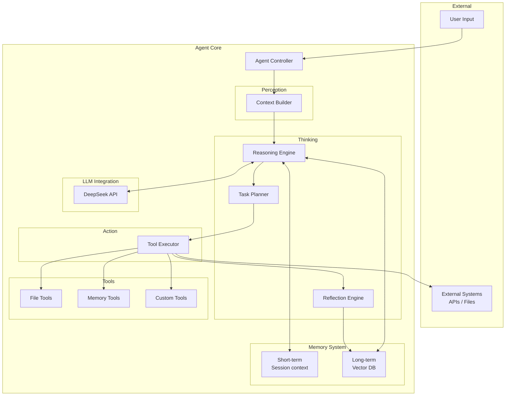

# Agent - AI Agent Learning Framework

A personal project built while learning AI Agent concepts — exploring and understanding the core ideas and implementation techniques behind AI Agents.

[中文文档](README_zh.md)

## Design Philosophy

### Core Principles
- **Learning goals**: Understand the fundamentals of AI Agents, master implementation techniques, explore real-world use cases
- **Design philosophy**: "Simple over complex", "Learn by doing", "Modular design"
- **Positioning**: A personal learning project — optimized for clarity and understanding, not production deployment

### Scope
- Implements the fundamental Agent loop: perceive → think → act → remember
- Interacts with external systems (APIs, file system)
- Short-term and long-term memory
- Modular architecture: start with high-level implementations, progressively replace modules with lower-level ones

### Key Concepts Demonstrated
Tool Calling · Chain of Thought · Planning & Execution · Reflection

## Features

### Core
- ✅ Perceive → Think → Act loop
- ✅ LLM integration (DeepSeek API)
- ✅ Tool system (file operations, etc.)
- ✅ Memory system (short-term / long-term)
- ✅ Config-driven behavior

### Advanced
- ✅ Task planning & decomposition (`--planning`)
- ✅ Reflection & self-improvement (`--reflection`)
- ✅ Multi-agent coordination (`enable_multi_agent=True`)
- ✅ TUI interface with real-time status display

## Quick Start

### Install

```bash
git clone https://github.com/Lykr/agent.git
cd agent

uv venv
source .venv/bin/activate  # Linux/Mac
uv pip install -e ".[dev]"
```

### Configure

Create a `.env` file:

```bash
DEEPSEEK_API_KEY=your_api_key_here
DEEPSEEK_BASE_URL=https://api.deepseek.com
```

### Run

```bash
# Basic mode
python examples/run_tui.py

# Enable task planning (breaks complex tasks into subtasks)
python examples/run_tui.py --planning

# Enable reflection (analyzes execution after each task)
python examples/run_tui.py --reflection

# Both
python examples/run_tui.py --planning --reflection

# All options
python examples/run_tui.py --help
```

### Code Examples

#### Basic usage

```python
from src.agent.core.agent import Agent
from src.agent.llm.deepseek import DeepSeekLLM
from src.agent.tools.file_tools import FileToolsFactory

llm = DeepSeekLLM()
tools = FileToolsFactory.create_basic_tools(allowed_directories=["."])
agent = Agent(llm=llm, tools=tools)

response = agent.run("Read the contents of README.md")
print(response)
```

#### With planning and reflection

```python
from src.agent.core.agent import Agent
from src.agent.llm.deepseek import DeepSeekLLM

llm = DeepSeekLLM()
agent = Agent(llm=llm, enable_planning=True, enable_reflection=True)

response = agent.run("Analyze the project structure and count lines of code in each Python file")
print(response)
```

#### Memory tools

```python
from src.agent.core.agent import Agent
from src.agent.llm.deepseek import DeepSeekLLM
from src.agent.tools.memory_tools import MEMORY_TOOLS

llm = DeepSeekLLM()
agent = Agent(llm=llm, tools=MEMORY_TOOLS)

agent.run("Remember that I prefer concise code over verbose code")
response = agent.run("What are my coding preferences?")
print(response)
```

## Architecture



## TUI Interface

```bash
# Basic
python examples/run_tui.py

# With config file and allowed directories
python examples/run_tui.py --config configs/agent.yaml --dir . --dir ./data

# Disable memory tools
python examples/run_tui.py --no-memory

# Enable advanced features
python examples/run_tui.py -p -r
```

| Option | Short | Description |
|--------|-------|-------------|
| `--config` | `-c` | Config file path (YAML) |
| `--name` | `-n` | Agent name |
| `--dir` | `-d` | Allowed directory (repeatable) |
| `--no-memory` | | Disable memory tools |
| `--planning` | `-p` | Enable task planning |
| `--reflection` | `-r` | Enable reflection engine |

## Project Structure

```
agent/
├── src/agent/
│   ├── core/                    # Core
│   │   ├── agent.py            # Agent class (planning, reflection, multi-agent)
│   │   ├── state.py            # State management
│   │   └── config.py           # Config management
│   ├── modules/                # Feature modules
│   │   ├── memory/
│   │   │   ├── short_term.py   # Short-term memory
│   │   │   └── long_term.py    # Long-term memory (ChromaDB)
│   │   ├── reasoning/
│   │   │   ├── planning.py     # Task planner
│   │   │   └── reflection.py   # Reflection engine
│   │   └── coordination/
│   │       └── multi_agent.py  # Multi-agent coordinator
│   ├── tools/
│   │   ├── base.py             # Tool base class
│   │   ├── file_tools.py       # File tools
│   │   └── memory_tools.py     # Memory tools
│   ├── llm/
│   │   ├── base.py             # LLM interface
│   │   ├── deepseek.py         # DeepSeek implementation
│   │   └── mock.py             # Mock LLM (for tests)
│   └── ui/
│       └── tui.py              # TUI implementation
├── examples/
│   └── run_tui.py              # Main entry point
├── tests/
├── configs/
└── docs/
```

## Development

```bash
uv pip install -e ".[dev]"

pytest tests/ -v --cov=src/agent --cov-report=term-missing
ruff check src tests
black src tests
mypy src

# Or via Makefile
make uv-check
```

### Adding a Tool

Subclass `BaseTool`, implement `name`, `description`, and `_execute_impl`:

```python
from src.agent.tools.base import BaseTool

class MyTool(BaseTool):
    @property
    def name(self) -> str:
        return "my_tool"

    @property
    def description(self) -> str:
        return "What this tool does"

    def _execute_impl(self, input_text: str) -> str:
        return f"Result: {input_text}"
```

### Adding an LLM Provider

Subclass `BaseLLM`, implement `generate()`, `chat()`, and `get_model_info()`:

```python
from src.agent.llm.base import BaseLLM

class MyLLM(BaseLLM):
    def generate(self, messages, **kwargs) -> str: ...
    def chat(self, message, **kwargs) -> str: ...
    def get_model_info(self) -> dict: ...
```

## Memory System

```
Perceive → [retrieve] → Think → Act → [store]
           ↑                          ↓
       [Short-term] <----------> [Long-term]
```

### Short-term memory

Manages session context: conversation history, working memory, importance-scored memory entries.

```yaml
memory:
  short_term:
    enabled: true
    max_entries: 20
    max_history: 10
```

### Long-term memory

Persistent semantic retrieval via ChromaDB:

```yaml
memory:
  long_term:
    enabled: true
    vector_db_provider: "chroma"
    persist_path: "./data/memory"
    collection_name: "agent_memories"
    embedding_model: "all-MiniLM-L6-v2"
    retrieval_threshold: 0.7
```

## Learning Path

### Phase 1: Basic Agent ✅
- Perceive → Think → Act loop
- LLM integration
- Tool system

### Phase 2: Memory System ✅
- Short-term and long-term memory
- Vector DB integration
- Memory retrieval strategies

### Phase 3: Advanced Features ✅
- Task planning and decomposition
- Reflection and self-improvement
- Multi-agent coordination

### Phase 4: Optimization
- Performance tuning
- Plugin system
- Production deployment

## License

MIT License — see [LICENSE](LICENSE)

## Contact

- GitHub: [@Lykr](https://github.com/Lykr)
- Project: [https://github.com/Lykr/agent](https://github.com/Lykr/agent)
