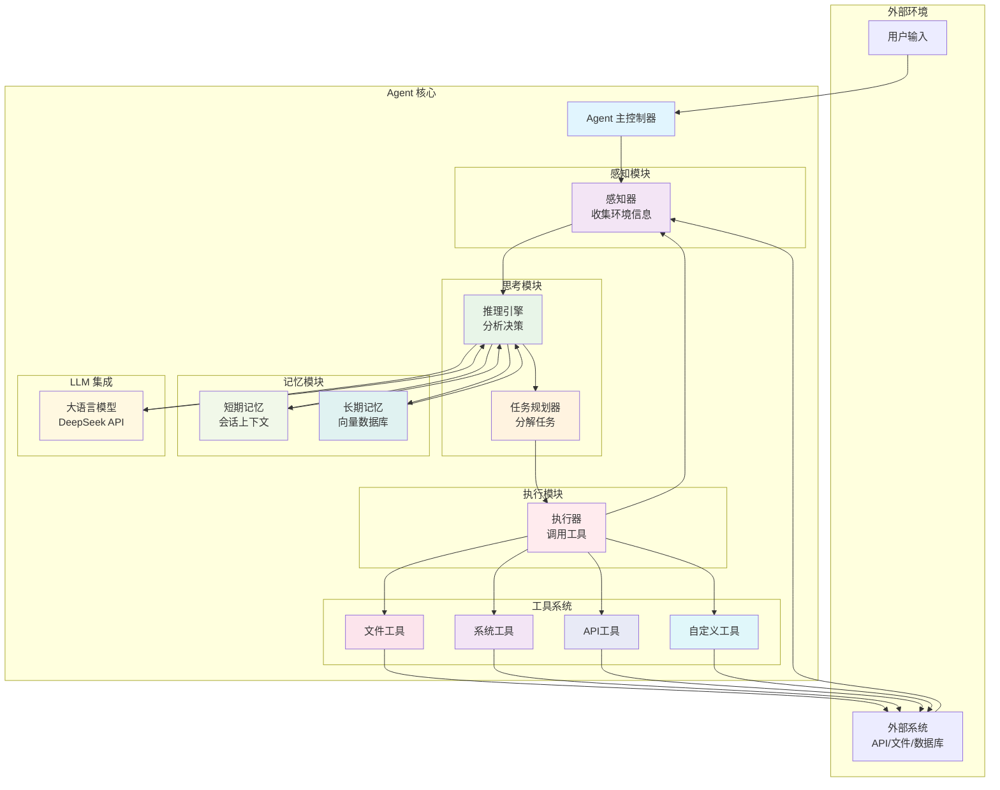

# Agent - AI Agent 学习框架

一个教学性质的AI Agent框架，用于学习和理解AI Agent的核心概念和实现技术。

## 设计理念

本项目基于以下设计理念构建，旨在提供一个清晰、可扩展的学习框架：

### 项目哲学与核心理念
- **根本学习目标**：理解AI Agent的基本原理、掌握具体的实现技术、探索AI Agent的应用场景
- **设计哲学**：体现"简单胜于复杂"、"从实践中学习"、"模块化设计"的理念
- **核心价值主张**：一个教学性质的AI Agent实现，注重学习价值而非生产部署

### 项目定位与边界
- **主要解决问题**：通用任务执行，能够处理多步骤的复杂任务
- **项目边界**：
  - 实现基本的Agent功能（感知、思考、执行、记忆）
  - 需要与外部系统交互（API、数据库、文件系统）
  - 需要记忆能力（短期记忆、长期记忆）
- **抽象层次**：两者结合，整体先用高层框架实现，后续逐步理解原理并分模块尝试底层实现，保证模块的可替换性

### 功能与模块设计
- **基本模块**：感知模块（信息获取）、思考模块（信息处理）、执行模块（结果输出）、记忆模块（经验存储）
- **关键概念展示**：工具使用（Tool Calling）、链式思考（Chain of Thought）、规划与执行（Planning & Execution）、反思与改进（Reflection）
- **复杂度控制**：多步骤任务的规划Agent，能够处理复杂的任务分解和执行

### 技术选择与实现路径
- **技术栈**：Python（最流行的AI开发语言）
- **AI能力集成**：云API（DeepSeek），后续可扩展支持其他模型
- **学习路径设计**：从简单到复杂逐步实现，每个版本都有明确的学习目标，有清晰的文档记录设计决策

### 项目结构与组织
- **设计原则**：清晰的关注点分离、易于理解的代码组织、良好的测试覆盖
- **文档重要性**：详细的实现说明、使用示例、设计决策记录
- **可扩展性考虑**：插件系统、模块替换、配置驱动

## 项目目标

1. **学习AI Agent基本原理**：通过实践理解Agent的感知-思考-执行循环
2. **掌握实现技术**：从基础到SOTA的Agent实现技术
3. **构建可扩展框架**：模块化设计，支持插件和扩展
4. **教学价值**：清晰的架构和详细的实现说明

## 功能特性

### 核心功能
- ✅ 感知-思考-执行循环
- ✅ LLM集成（DeepSeek API）
- ✅ 工具系统（文件操作、系统命令等）
- ✅ 记忆系统（短期/长期记忆）
- ✅ 配置驱动行为

### 高级功能
- 🔄 任务规划和分解
- 🔄 反思和自我改进
- 🔄 多步骤任务执行
- 🔄 插件系统

## 快速开始

### 安装

#### 使用 uv（推荐）
[uv](https://github.com/astral-sh/uv) 是一个快速的Python包管理器和解析器。

```bash
# 克隆项目
git clone https://github.com/Lykr/agent.git
cd agent

# 使用uv创建虚拟环境并安装依赖
uv venv
source .venv/bin/activate  # Linux/Mac
# 或 .venv\Scripts\activate  # Windows

# 安装依赖
uv pip install -e .
```

#### 使用传统方法
```bash
# 克隆项目
git clone https://github.com/Lykr/agent.git
cd agent

# 创建虚拟环境
python -m venv venv
source venv/bin/activate  # Linux/Mac
# 或 venv\Scripts\activate  # Windows

# 安装依赖
pip install -e .
```

### 配置

创建 `.env` 文件：

```bash
DEEPSEEK_API_KEY=your_api_key_here
DEEPSEEK_BASE_URL=https://api.deepseek.com
```

### 基本使用

```python
from agent.core.agent import Agent
from agent.llm.deepseek import DeepSeekLLM
from agent.tools.file_tools import FileReadTool, FileWriteTool

# 创建LLM实例
llm = DeepSeekLLM()

# 创建Agent
agent = Agent(llm=llm)

# 添加工具
agent.add_tool(FileReadTool())
agent.add_tool(FileWriteTool())

# 运行Agent
response = agent.run("请读取README.md文件的内容")
print(response)
```

## 系统架构



## 项目结构

```
agent/
├── src/agent/
│   ├── core/                    # 核心模块
│   │   ├── agent.py            # Agent主类
│   │   ├── state.py            # 状态管理
│   │   └── config.py           # 配置管理
│   ├── modules/                # 功能模块
│   │   ├── perception/         # 感知模块
│   │   ├── reasoning/          # 思考模块
│   │   ├── execution/          # 执行模块
│   │   └── memory/             # 记忆模块
│   ├── tools/                  # 工具系统
│   │   ├── base.py             # 工具基类
│   │   ├── file_tools.py       # 文件工具
│   │   └── system_tools.py     # 系统工具
│   └── llm/                    # LLM集成
│       ├── base.py             # LLM接口
│       ├── deepseek.py         # DeepSeek实现
│       └── mock.py             # 模拟LLM
├── examples/                   # 示例代码
├── tests/                      # 测试代码
├── docs/                       # 文档
├── configs/                    # 配置文件
└── scripts/                    # 工具脚本
```

## 开发指南

### 设置开发环境

#### 使用 uv
```bash
# 安装开发依赖
uv pip install -e ".[dev]"

# 运行测试
pytest

# 代码格式化
black src tests

# 类型检查
mypy src

# 代码检查
ruff check src

# 或者使用 Makefile
make uv-dev-install  # 安装开发依赖
make test           # 运行测试
make lint           # 代码检查
make format         # 代码格式化
```

#### 使用传统方法
```bash
# 安装开发依赖
pip install -e ".[dev]"

# 运行测试
pytest

# 代码格式化
black src tests

# 类型检查
mypy src

# 代码检查
ruff check src
```

### 添加新工具

```python
from agent.tools.base import Tool

class MyCustomTool(Tool):
    name = "my_custom_tool"
    description = "我的自定义工具描述"

    def execute(self, input_text: str) -> str:
        # 实现工具逻辑
        return f"处理结果: {input_text}"
```

### 贡献

1. Fork 项目
2. 创建功能分支 (`git checkout -b feature/amazing-feature`)
3. 提交更改 (`git commit -m 'Add amazing feature'`)
4. 推送到分支 (`git push origin feature/amazing-feature`)
5. 创建 Pull Request

## 学习路径

### 阶段1：基础Agent框架
- 理解感知-思考-执行循环
- 掌握LLM集成
- 学习工具系统设计

### 阶段2：记忆系统
- 实现短期和长期记忆
- 学习向量数据库集成
- 掌握记忆检索策略

### 阶段3：高级功能
- 任务规划和分解
- 反思和自我改进
- 多Agent协作

### 阶段4：优化和扩展
- 性能优化
- 插件系统
- 生产部署

## 许可证

MIT License - 详见 [LICENSE](LICENSE) 文件

## 联系方式

- GitHub: [@Lykr](https://github.com/Lykr)
- 项目地址: [https://github.com/Lykr/agent](https://github.com/Lykr/agent)