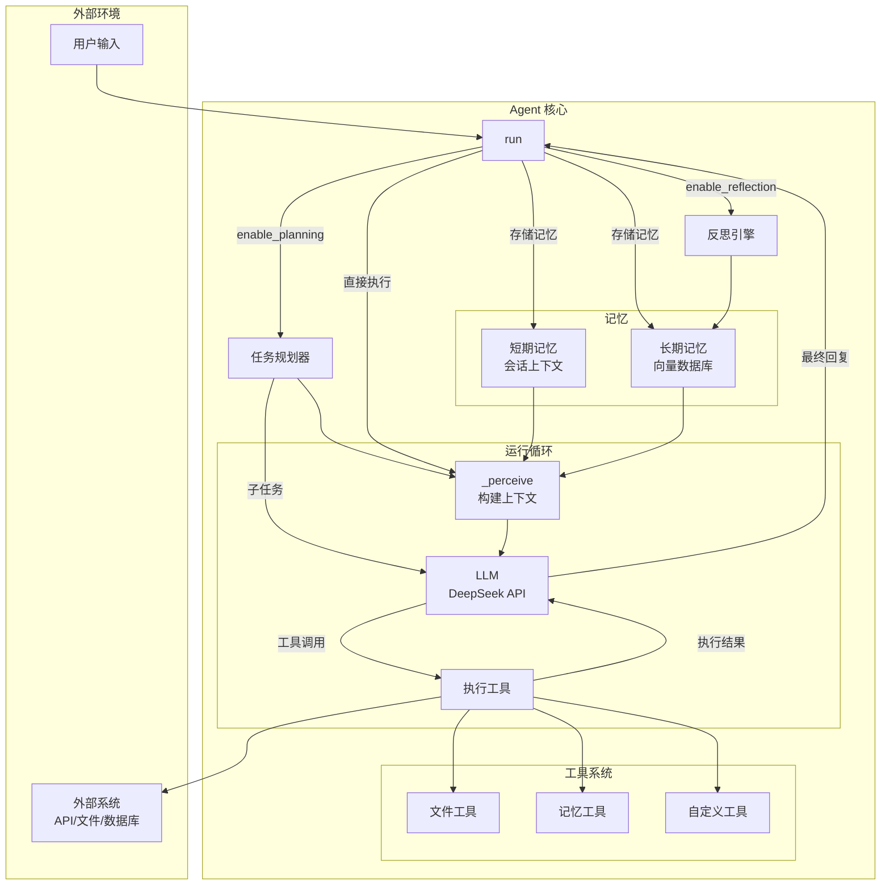

# Agent - AI Agent 学习框架

作者在学习AI Agent相关知识过程中构建的实践项目，用于探索和理解AI Agent的核心概念与实现技术。

## 设计理念

本项目基于以下设计理念构建，旨在提供一个清晰、可扩展的学习框架：

### 项目哲学与核心理念
- **根本学习目标**：理解AI Agent的基本原理、掌握具体的实现技术、探索AI Agent的应用场景
- **设计哲学**：体现"简单胜于复杂"、"从实践中学习"、"模块化设计"的理念
- **核心价值主张**：作者个人学习Agent技术的实践项目，注重学习价值而非生产部署

### 项目定位与边界
- **主要解决问题**：通用任务执行，能够处理多步骤的复杂任务
- **项目边界**：
  - 实现基本的Agent功能（感知、思考、执行、记忆）
  - 需要与外部系统交互（API、数据库、文件系统）
  - 需要记忆能力（短期记忆、长期记忆）
- **抽象层次**：两者结合，整体先用高层框架实现，后续逐步理解原理并分模块尝试底层实现，保证模块的可替换性

### 功能与模块设计
- **基本模块**：感知模块（信息获取）、思考模块（信息处理）、执行模块（结果输出）、记忆模块（经验存储）
- **关键概念展示**：工具使用（Tool Calling）、链式思考（Chain of Thought）、规划与执行（Planning & Execution）、反思与改进（Reflection）
- **复杂度控制**：多步骤任务的规划Agent，能够处理复杂的任务分解和执行

### 技术选择与实现路径
- **技术栈**：Python（最流行的AI开发语言）
- **AI能力集成**：云API（DeepSeek），后续可扩展支持其他模型
- **学习路径设计**：从简单到复杂逐步实现，每个版本都有明确的学习目标，有清晰的文档记录设计决策

### 项目结构与组织
- **设计原则**：清晰的关注点分离、易于理解的代码组织、良好的测试覆盖
- **文档重要性**：详细的实现说明、使用示例、设计决策记录
- **可扩展性考虑**：插件系统、模块替换、配置驱动

## 项目目标

1. **学习AI Agent基本原理**：通过实践理解Agent的感知-思考-执行循环
2. **掌握实现技术**：从基础到SOTA的Agent实现技术
3. **构建可扩展框架**：模块化设计，支持插件和扩展

## 功能特性

### 核心功能
- ✅ 感知-思考-执行循环
- ✅ LLM集成（DeepSeek API）
- ✅ 工具系统（文件操作等）
- ✅ 记忆系统（短期/长期记忆）
- ✅ 配置驱动行为

### 高级功能
- ✅ 任务规划和分解（`--planning`）
- ✅ 反思和自我改进（`--reflection`）
- ✅ 多Agent协作（`enable_multi_agent=True`）
- ✅ 优雅的TUI界面（实时状态显示）

## 快速开始

### 安装

```bash
# 克隆项目
git clone https://github.com/Lykr/agent.git
cd agent

# 使用uv创建虚拟环境并安装依赖
uv venv
source .venv/bin/activate  # Linux/Mac
uv pip install -e ".[dev]"
```

### 配置

创建 `.env` 文件：

```bash
DEEPSEEK_API_KEY=your_api_key_here
DEEPSEEK_BASE_URL=https://api.deepseek.com
```

### 运行

```bash
# 基础模式
python examples/run_tui.py

# 启用任务规划（将复杂任务分解为子任务）
python examples/run_tui.py --planning

# 启用反思（任务完成后分析执行过程）
python examples/run_tui.py --reflection

# 同时启用
python examples/run_tui.py --planning --reflection

# 更多选项
python examples/run_tui.py --help
```

### 代码示例

#### 基础用法

```python
from src.agent.core.agent import Agent
from src.agent.llm.deepseek import DeepSeekLLM
from src.agent.tools.file_tools import FileToolsFactory

llm = DeepSeekLLM()
tools = FileToolsFactory.create_basic_tools(allowed_directories=["."])
agent = Agent(llm=llm, tools=tools)

response = agent.run("请读取README.md文件的内容")
print(response)
```

#### 启用任务规划与反思

```python
from src.agent.core.agent import Agent
from src.agent.llm.deepseek import DeepSeekLLM

llm = DeepSeekLLM()
agent = Agent(llm=llm, enable_planning=True, enable_reflection=True)

response = agent.run("分析项目结构，列出所有Python文件并统计代码行数")
print(response)
```

#### 记忆工具

```python
from src.agent.core.agent import Agent
from src.agent.llm.deepseek import DeepSeekLLM
from src.agent.tools.memory_tools import MEMORY_TOOLS

llm = DeepSeekLLM()
agent = Agent(llm=llm, tools=MEMORY_TOOLS)

agent.run("请记住我喜欢Python编程和机器学习")
response = agent.run("我之前说过我喜欢什么？")
print(response)
```

## 系统架构



## TUI界面

Agent框架提供了一个终端用户界面（TUI），实时显示Agent的运行状态和活动日志。

### 使用方式

```bash
# 基础运行
python examples/run_tui.py

# 指定配置文件和工作目录
python examples/run_tui.py --config configs/agent.yaml --dir . --dir ./data

# 禁用记忆工具
python examples/run_tui.py --no-memory

# 启用高级功能
python examples/run_tui.py -p -r  # planning + reflection
```

所有选项：

| 选项 | 简写 | 说明 |
|------|------|------|
| `--config` | `-c` | 配置文件路径（YAML） |
| `--name` | `-n` | Agent 名称 |
| `--dir` | `-d` | 允许访问的目录（可多次使用） |
| `--no-memory` | | 禁用记忆工具 |
| `--planning` | `-p` | 启用任务规划 |
| `--reflection` | `-r` | 启用反思引擎 |

## 项目结构

```
agent/
├── src/agent/
│   ├── core/                    # 核心模块
│   │   ├── agent.py            # Agent主类（含规划、反思、多Agent协作）
│   │   ├── state.py            # 状态管理
│   │   └── config.py           # 配置管理
│   ├── modules/                # 功能模块
│   │   ├── memory/             # 记忆模块
│   │   │   ├── short_term.py   # 短期记忆
│   │   │   └── long_term.py    # 长期记忆（ChromaDB）
│   │   ├── reasoning/          # 推理模块
│   │   │   ├── planning.py     # 任务规划器
│   │   │   └── reflection.py   # 反思引擎
│   │   └── coordination/       # 协调模块
│   │       └── multi_agent.py  # 多Agent协调器
│   ├── tools/                  # 工具系统
│   │   ├── base.py             # 工具基类
│   │   ├── file_tools.py       # 文件工具
│   │   └── memory_tools.py     # 记忆工具
│   ├── llm/                    # LLM集成
│   │   ├── base.py             # LLM接口
│   │   ├── deepseek.py         # DeepSeek实现
│   │   └── mock.py             # 模拟LLM（用于测试）
│   └── ui/                     # 用户界面
│       └── tui.py              # TUI实现
├── examples/
│   └── run_tui.py              # 主运行脚本
├── tests/                      # 测试代码
├── configs/                    # 配置文件
└── docs/                       # 文档
```

## 开发指南

```bash
# 安装开发依赖
uv pip install -e ".[dev]"

# 运行测试
pytest tests/ -v --cov=src/agent --cov-report=term-missing

# 代码检查 + 格式化
ruff check src tests
black src tests
mypy src

# 或者使用 Makefile
make uv-check
```

### 添加新工具

继承 `BaseTool`，实现 `name`、`description` 和 `_execute_impl`：

```python
from src.agent.tools.base import BaseTool

class MyTool(BaseTool):
    @property
    def name(self) -> str:
        return "my_tool"

    @property
    def description(self) -> str:
        return "工具描述"

    def _execute_impl(self, input_text: str) -> str:
        return f"处理结果: {input_text}"
```

### 添加新LLM提供商

继承 `BaseLLM`，实现 `generate()`、`chat()` 和 `get_model_info()`：

```python
from src.agent.llm.base import BaseLLM

class MyLLM(BaseLLM):
    def generate(self, messages, **kwargs) -> str: ...
    def chat(self, message, **kwargs) -> str: ...
    def get_model_info(self) -> dict: ...
```

## 记忆系统

### 架构

```
感知 → [记忆检索] → 思考 → 执行 → [记忆存储]
       ↑                          ↓
    [短期记忆] <------------> [长期记忆]
```

### 短期记忆

管理当前会话的上下文：对话历史、工作记忆、按重要性评分的记忆片段。

```yaml
memory:
  short_term:
    enabled: true
    max_entries: 20
    max_history: 10
```

### 长期记忆

使用 ChromaDB 实现持久化语义检索：

```yaml
memory:
  long_term:
    enabled: true
    vector_db_provider: "chroma"
    persist_path: "./data/memory"
    collection_name: "agent_memories"
    embedding_model: "all-MiniLM-L6-v2"
    retrieval_threshold: 0.7
```

## 学习路径

### 阶段1：基础Agent框架 ✅
- 感知-思考-执行循环
- LLM集成
- 工具系统设计

### 阶段2：记忆系统 ✅
- 短期和长期记忆实现
- 向量数据库集成
- 记忆检索策略

### 阶段3：高级功能 ✅
- 任务规划和分解
- 反思和自我改进
- 多Agent协作

### 阶段4：优化和扩展
- 性能优化
- 插件系统
- 生产部署

## 许可证

MIT License - 详见 [LICENSE](LICENSE) 文件

## 联系方式

- GitHub: [@Lykr](https://github.com/Lykr)
- 项目地址: [https://github.com/Lykr/agent](https://github.com/Lykr/agent)
